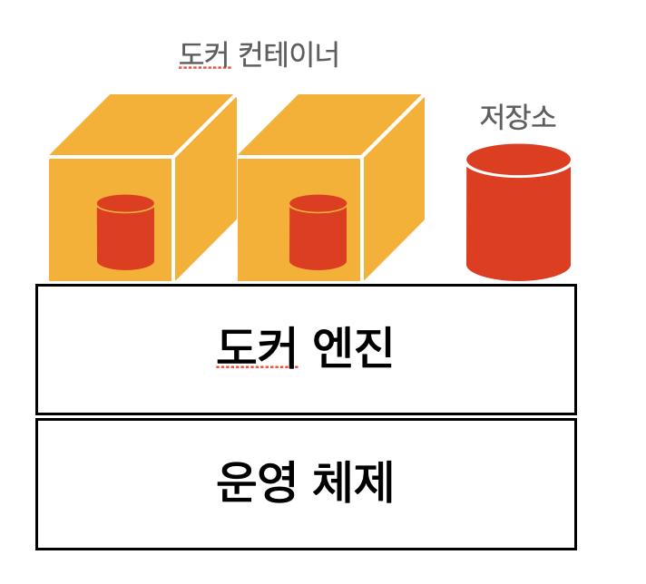

# 도커 마운트 하기
## 도커를 도입하면서 생긴 문제
   도커를 사용하면 컨테이너 안의 데이터 영역을 사용한다. 예를 들어 MySQL을 도커를 이용하여 사용하면 MySQL 컨테이너 안의 데이터 저장소에 DB 데이터가 저장이 된다.
   
문제는 도커 컨테이너는 소프트웨어 업그레이드 등의 이유로 언젠가는 삭제된다는 것이다. 이런 컨테이너의 생성 및 폐기는 매우 빈번하기 때문에 컨테이너의 재생성시마다 이런 데이터를
옮겨주는 것은 까다로울 수 있다. 도커에서는 컨테이너가 외부의 데이터 저장 영역, 즉 내 컴퓨터의 데이터에 접근할 수 있는 기능을 제공한다. 이를 데이터 퍼시스턴시라고 한다.

## 도커의 스토리지 마운트
   마운트란 usb를 컴퓨터와 연결하는 것처럼 컨테이너와 데이터 저장 영역을 연결하는 것을 말한다. 도커에는 두 가지 종류의 스토리지 마운트가 있다. 
   
### 1. 볼륨 마운트 
   볼륨 마운트는 도커 엔진이 관리하는 영역 내에 만들어진 볼륨을 컨테이너에 디스크 형태로 마운트하는 것을 말한다.

- 볼륨 마운트는 도커 엔진이 관리하므로 사용자가 파일 위치를 신경 쓸 필요 없다.
- 운영체제에 따라 명령어가 달라지는 등의 의존성 문제도 일어나지 않는다.
- 도커 컨테이너를 경유하지 않고 직접 볼륨에 접근할 방법이 없다. 따라서 백업도 쉽지 않다.

### 2. 바인드 마운트
   도커가 설치된 컴퓨터에 접근하여 유틸리티 폴더 등 도커 엔진에서 관리하지 않는 영역의 기존 디렉토리를 컨테이너에 마운트 하는 방식이다.

- 도커가 관리하지 않는 영역에도 파일을 둘 수 있어 접근이 용이하며, IDE 등 소프트웨어를 이용한 방식으로 파일을 이용할 수 있다.

각각의 마운트 방법은 간편함과 파일 접근 가능 여부에 차이가 있으므로 파일을 직접 관리하고 편집해야 할 일이 많으면 바인드 마운트를 사용하고
그렇지 않으면 볼륨 마운트를 사용하자.

 