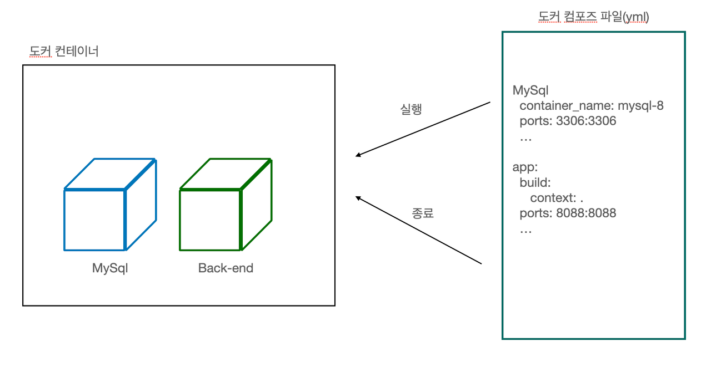
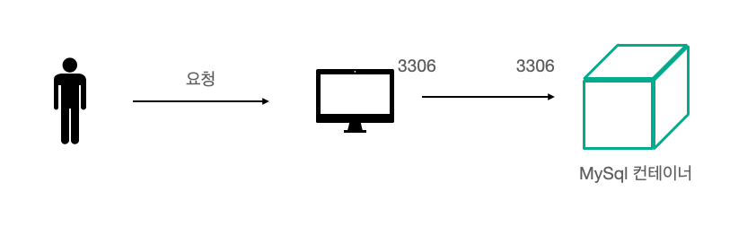

# Docker Compose를 이용한 서버 실행
## [도커 컴포즈]
보통 도커를 사용하여 프로젝트를 관리하면 여러개의 컨테이너를 실행하고 관리하게 되는데 (DB랑 백엔드 프로젝트 하나만 묶어도 2개이다), 
모든 컨테이너를 ps 커맨드로 확인하면서 관리하는게 쉽지만은 않다. 이런 불편함을 해소하고자 나온 것이 도커 컴포즈이다.  
도커 컴포즈는 시스템 구축과 관련된 명령어를 하나의 텍스트 파일에 기재해 명령어 한번에 시스템 전체를 실행하고 종료할 수 있도록 도와준다.

## [도커 컴포즈 실습]
간단하게 진행하고 있는 백엔드 프로젝트로 도커 컴포즈 실습을 진행하였다. 일단 필요한 컨테이너는 총 두 가지이다.

1. MySQL DB 컨테이너
2. 스프링부트 .jar파일을 빌드하고 실행해주는 컨테이너

  
도커 컴포즈 도식도

도식도는 위와 같으며 yml으로 된 도커 컴포즈 파일을 작성함으로써 이 도커 컨테이너가 같이 실행되고 종료될 수 있게 만들어보자.   

### [컴포즈 파일 작성]
컴포즈 파일을 작성하는 것은 커맨드에 입력하던 명령어를 yml형식으로 옮기는 것으로 생각하면 된다. 예를 들어 다음과 같은 명령어를 실행한다고 해보자.

docker run --name spring_be -d -p 8080:8080 image_name 명령어는 다음과 같이 작성할 수 있다.

~~~yml
version: "3"
services:
    spring_be:
    image: image_name
    ports:
    - 8080:8080
~~~

 
도커 컴포즈는 크게 다음과 같이 구성되어 있으며 service, networks, volumes순으로 작성한다.  
services : 컨테이너에 대한 내용으로 도커 컴포즈에서는 컨테이너의 집합체를 서비스라고 부른다.  
networks : 네트워크는 기본적으로 프로세스 간에 통신에 대한 것으로, 여기서는 도커 컨테이너간의 통신을 위한 네트워크를 말한다. 
volumes : 볼륨 관련 정보를 적는 영역 

 
이제 실제 프로젝트를 위한 도커 컴포즈 파일을 작성해보자. 먼저 mysql 부분부터 작성할 것이다.

~~~yml
services:
  mysql:
    container_name: mysql-8.0.30  ## 도커 컨테이너 이름
    image: mysql:8.0.30           ## 도커 이미지
    ports:
      - "3306:3306"               ## 입력 포트:도커 포트
    environment:                  ## 데이터베이스 접속에 필요한 환경 변수들을 설정한다.
      - MYSQL_DATABASE=voca-api   
      - MYSQL_USER=local
      - MYSQL_PASSWORD=localpassword
      - MYSQL_ROOT_PASSWORD=vanille
      - TZ=Asia/Seoul
    networks:                     ## 도커 컨테이너끼리 통신할 네트워크
      - voca
~~~

이제는 Spring(Gradle)로 구성된 프로젝트에 대한 컴포즈 파일이다.
~~~yml
version: "3.8"
services:
  mysql:
    ...
  voca-backend:
   build:
    context: .
    dockerfile: Dockerfile
   ports:
    - 8088:8088
   container_name: voca-backend
   restart: always
   environment:
    SPRING_DATASOURCE_URL: jdbc:mysql://mysql:3306/voca-api?characterEncoding=UTF-8&serverTimezone=Asia/Seoul
    SPRING_DATASOURCE_USERNAME: local
    SPRING_DATASOURCE_PASSWORD: localpassword
    spring.profiles.active: local
   depends_on:
    - mysql
   networks:
    - voca
~~~

여기서 시간이 걸렸던 포인트는 3가지였다.

1. SPRING_DATASOURCE_URL의 입력 정보 - 현재 MySql 컨테이너를 이용해 구동하고 있으므로 도커 컨테이너에게 localhost가 아닌 MySql 컨테이너의 정보를 넘겨주어야 한다.

좀 더 자세히 알아보면, 다음과 같이 사용자 요청이 3306포트로 들어오면 실행 중인 컴퓨터는 3306포트를 가진 도커 컨테이너와 연결한다. 즉, localhost를 넘겨주게 되면 이는 voca-backend의 localhost를 의미하게 되고 voca-backend 컨테이너와 MySql 컨테이너는 서로 다른 컨테이너이므로 연결되지 않는다.

  
실행 중 컴퓨터와 도커 컨테이너의 관계

2. spring.profile.active 설정 - 스프링 부트에 대한 로그가 전혀 뜨지 않고 계속 재시작되는 문제가 있어 Dockerfile로 만들어 실행해봤는데도 안되는 문제가 있었고, jar파일을 수동으로 실행해보는 과정에서 profile 설정을 안했다는 것을 알 수 있었다. 만약 로그가 안나오고 도커 컨테이너가 계속 재시작 된다면 이를 의심해보자.  
 `spring.profiles.active: local`

3. depends_on 설정 : depends_on은 특정 컨테이너 다음에 실행되어야 할 때(위와 같이 MySQL서버가 올라간 뒤에 프로젝트를 배포해야할 때) 사용한다. depends_on 에 사용할 서비스의 이름을 명시해주면 mysql 컨테이너가 올라간 뒤에 voca-backend 서비스가 올라간다.

마지막으로 networks이다. networks는 도커 컨테이너간의 통신을 할 수 있도록 해주는 용도로 voca라는 네트워크로 통신하게끔 만들었다.
~~~yml
version: "3.8"
services:
  ...
networks:
  voca:
~~~