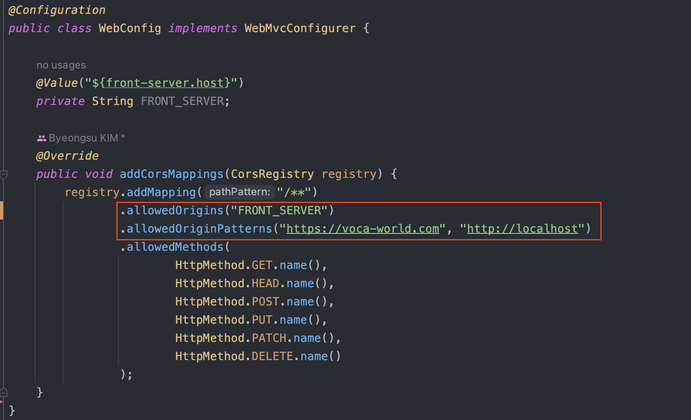

# docker compose를 이용한 서버 실행2

이전에는 voca 프로젝트의 backend 스프링 프로젝트와 DB를 컨테이너로 올리는 작업을 진행하였다. 현재 운영 서버는 Nginx를 이용하고 있어 이를 맞추고자 한다.

## vue 빌드하기
웹브라우저는 HTML, CSS, JS 이 세개의 언어만 해석할 수 있기 때문에 모든 사람이 이용하게 하려면 App.vue파일을 그대로 올리는 것이 아닌 build를 해야 한다.
Vue 프로젝트는 `npm run build` 명령어를 통해 간단하게 빌드할 수 있다. 빌드가 성공하면 dist라는 폴더가 생기는데 이 폴더를 그대로 서버에 올리면 된다.

이를 도커 파일로 작성해보자.
1. dockerfile을 프론트 프로젝트 루트에 생성한다.
~~~dockerfile
FROM node:latest as build-stage
# 디렉토리 전환 명령어로 이후의 명령어는 모두 /app 경로를 기준으로 동작한다.
WORKDIR /app
# package.json이름을 가진 파일을 모두 workdir폴더로 복사한다.
COPY package*.json ./

RUN npm install

# 현재 폴더를 workdir폴더에 복사한다.
COPY ./ .     
# 빌드하기 !

RUN npm run build
~~~

2. 웹 서버에 배포하기  
   Nginx를 이용하여 웹 서버에 배포하였다. 프론트 dockerfile에 같이 작성하였다.
~~~dockerfile
FROM nginx as production-stage
RUN mkdir /app
# build-stage에서 생성한 /app/dist의 모든 파일을 /app으로 이동시킨다.
COPY --from=build-stage /app/dist /app
# nginx.conf파일을 도커의 nginx 설정파일로 복사한다. 
COPY /nginx/nginx.conf /etc/nginx/nginx.conf
~~~

3. nginx.conf파일 작성하기
필요한 부분만 발췌하였다. 일단 '/' 경로로 들어오면 웹 서버에 있는 정적 index.html파일을 사용할 수 있도록 하였다. 만약 '/api'로 들어오면 백엔드 서버가 사용될 수 있도록
리버스 프록시를 적용하였다.  
~~~nginx configuration
...
...
http {
  server {
    listen       80;
    server_name  localhost;
    location / {
      root   /app;
      index  index.html;
      try_files $uri $uri/ /index.html;
    }

    location /api {
        # 리버스 프록시
        # 도커 컴포즈의 같은 네트워크 상에 있다면 컨테이너 이름으로 컨테이너간 통신이 가능하다. 
        proxy_pass http://voca-backend:8088;
        
        # cors 에러 방지용
        proxy_set_header X-Real-IP $remote_addr;
        proxy_set_header X-Forwarded-For $proxy_add_x_forwarded_for;
        proxy_set_header Host $http_host;
    }
  }
}
~~~

## 도커 컴포즈 작성
voca-front의 경로를 지정해서 Dockerfile을 찾을 수 있게 지정해주었으며, 포트는 80번 포트로 지정하였다. 
백엔드 서버가 동작해야 유의미한 작업이 가능하므로 백엔드 서버 실행 이후 웹 서버 컨테이너가 동작하도록 지정해주었다. 
~~~yml
  voca-front:
    container_name: voca-front
    # 빌드 할 경로와 Dockerfile 이름을 지정하였다.
    build:
      context: ../voca-front
      dockerfile: Dockerfile
    ports:
      - 80:80
    restart: always
    # voca-backend 컨테이너 생성 이후에 이 컨테이너가 올라간다.
    depends_on:
      - voca-backend
    networks:
      - voca
~~~

## 트러블 슈팅
프론트 서버에서 백엔드 서버로 API 요청을 할 때마다 다음과 같은 로그가 발생하였다.

기본적으로 스프링에서 cors를 해결하는 가장 쉬운 방법은 허용할 url을 맵핑해주는 것이다.   

cors는 프로토콜, 호스트, 포트번호까지 일치해야 같은 출처로 본다. 이를 맞춰서 스프링에 추가를 해줬음에도 불구하고 에러가 해결되지 않았다.

이를 해결하기 위한 시도는 다음과 같다.

1. 에러의 원인을 파악하기 위해 모든 cors를 모두 오픈한 뒤에 테스트 해보았지만 해결할 수 없었다.
2. 도커 컨테이너간의 다른 ip주소를 사용하기 때문에 같은 localhost를 못 받는건가해서 docker container의 IP주소를 그대로 넣어보았지만 해결할 수 없었다.
3. 헤더에 클라이언트의 ip정보를 추가함으로써 해결하였다.
Nginx는 기본적으로 요청을 전송할 때 두 가지 헤더 정보 (Host, Connection)을 재정의한다. 기본 셋팅은 `Host=$proxy_host, Connection=close`이다.  
즉, 프록시 서버가 요청을 백엔드 서버로 전송하려면 헤더를 추가해주어야 한다.

좀 더 자세히 설명하면, 프록시 서버는 전용 프로토콜로 요청을 보낸후에 받은 결과를 가공하여 클라이언트에 재전송하게 된다. 이로 인해 처리한 웹 서버에서 request.getRemoteAddr()등으로 로그를 찍어보면
proxy ip를 얻게된다.

이를 해결하기 위해 다음과 같은 코드들을 추가하였다.
1. X-Real-IP를 설정한다.  
`   proxy_set_header X-Real-IP $remote_addr;`
2. X-Forwarded-For를 설정한다. 
 - X-Forwarded-For: 이전 프록시 서버가 또 있다면 그 IP 정보를 가지고 있다. 
 - proxy_add_x_forwarded_for: 요청 헤더와 그 뒤에 따라오는 클라이언트의 원격 주스를 포함한 호스트명을 의미한다.   
`   proxy_set_header X-Forwarded-For $proxy_add_x_forwarded_for;`  

3. http요청의 호스트 이름 지정
 - $http_host : HTTP Request의 호스트 헤더값  
 `  proxy_set_header Host $http_host;`

~~~nginx configuration
proxy_set_header X-Real-IP $remote_addr;
proxy_set_header X-Forwarded-For $proxy_add_x_forwarded_for;
proxy_set_header Host $http_host;
~~~

