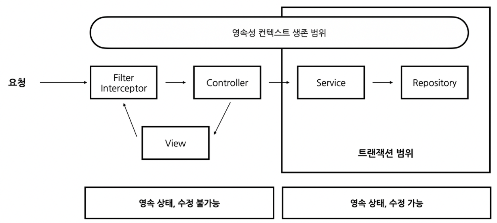

# OSIV
## OSIV란? (Open Session In View)
   스프링의 트랜잭션 범위는 Service, Repository 레이어에서만 유지된다. 보통 JPA의 영속성 컨텍스트는 트랜잭션의 생명주기를 따라가는데, OSIV를 이용하면 
   영속성 컨텍스트의 생명주기를 뷰(컨트롤러)레이어까지 유지할 수 있다. 즉, 영속 상태를 컨트롤러에서까지 유지하기 때문에 컨트롤러 레이어에서 지연로딩이 가능해진다. 

## 스프링 OSIV의 동작 원리
스프링이 제공하는 OSIV에는 두 가지 방법이 있으며 차이는 영속성 컨텍스트가 언제 생기는지에 있다.  
1. Servlet Filter를 이용하는 방법
2. Interceptor를 이용하는 방법

  
스프링 트랜잭션

   

기본적으로 동작하는 과정은 동일하다.
1. 사용자로부터 요청이 들어오면 설정에 따라 Filter 또는 Interceptor에서 영속성 컨텍스트를 생성한다.
2. Service, Repository 레이어로 들어가면 트랜잭션이 시작되고 비즈니스 로직이 완료되면 트랜잭션이 종료된다. (flush 호출)
3. 트랜잭션은 종료되었지만, DB 커넥션은 닫혀있지 않기 때문에 컨트롤러 레이어에서 지연 로딩이 가능하다.
4. 요청의 처리가 끝나면 close 메서드를 호출해 영속성 컨텍스트를 종료한다.

## OSIV의 활용
1. View에서 Entity 객체를 지연 로딩하거나 제어하는 경우
2. 같은 영속성 컨텍스트 내에서 여러 트랜잭션을 공유하는 경우

OSIV는 요청이 들어온 시점부터 응답이 끝날 때 까지 영속성 컨텍스트와 DB 커넥션을 유지하기 때문에 많은 리소스를 사용한다.
따라서 실시간 트래픽이 중요한 애플리케이션에서는 커넥션이 부족해지는 문제가 발생할 수 있다. 

만약 OSIV를 끈 상태로 엔티티를 제어해야 하는 경우가 있다면 Command와 Query를 분리하는 방법을 사용하는 것이 좋다.

## 커맨드와 쿼리 분리 
복잡한 화면의 출력을 위해 많은 복잡한 쿼리가 나가는 경우 성능 최적화가 중요한데, 화면을 위한 비즈니스 서비스 레이어와 핵심 비즈니스 로직을 분리함으로써 이를 해결할 수 있다.
WordService
 - WordService : 핵심 비즈니스 로직
 - WordQueryService : 화면과 관련된 서비스 로직 (주로 읽기 전용 트랜잭션)

