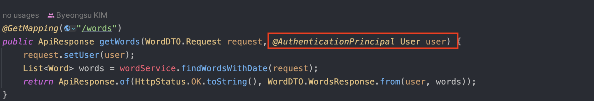

# OSIV 필터
## @AuthenticationPrincipal과 지연 로딩

@AuthenticationPrincipal 어노테이션을 이용하면 간편하게 session에 저장한 객체를 쉽게 받을 수 있다.
그런데 파라미터로 받은 객체를 가지고 지연 로딩을 하면 프록시 객체를 가지고 있기 때문에 에러가 발생한다.

현재 SecurityContextHolder에 session을 저장하는 코드는 인터셉터에 다음과 같이 되어 있다.  

인터셉터 코드 일부

## 에러 발생 이유
### 1. OSIV는 기본적으로 인터셉터에서 시작한다. 
OSIV는 기본 설정이 인터셉터에 엔티티 매니저를 생성하는 것으로 되어있다. 

### 2. interceptor보다 filter가 먼저 실행된다.
기본적으로 사용자에게 요청이 들어오면 로직을 처리하는 흐름은 다음과 같다.
~~~
 사용자 요청 -> filter -> interceptor -> controller -> service -> repository ->
  사용자          <-          view          <-         Controller          <-|
~~~ 

### 3. 스프링 시큐리티는 기본적으로 Filter 기반으로 동작한다.

## 해결
### 1. 영속화 시키기 위해 조회작업을 다시 거친다. 
~~~java
@Override
public Word saveWord(WordDTO.NewWord request) throws IllegalAccessException {
    // 이처럼 다시 조회한다. 
    User user = userRepository.findById(request.getUser().getId()).orElseThrow(() -> new NotFoundException(ErrorCode.NOT_FOUND_USER));
    
    if(vocabulary != null && !vocabulary.getCreatedBy().equals(user.getId())) {
        throw new IllegalAccessException(ErrorCode.NO_AUTHORITY.getMessage());
    }
}
~~~

### 2. 사용하는 시점에 지연 로딩 값도 같이 가져오기
~~~java
User userDetails;
try {
    String username = JwtTokenUtils.getUsername(token, secretKey);
    userDetails = userService.findUserByUsername(username);
    
    // 다음과 같이 지연 로딩 객체를 초기화해준다.
    userDetails.getVocabularies(); 
    
    ...
} catch (Exception e) {
    throw new ExpiredTokenException(ErrorCode.EXPIRED_TOKEN);
}

~~~

### 3. OSIV를 필터부터 적용해준다. 
이를 해결하기 위해선 OSIV가 필터부터 시작할 수 있도록 해주어야 한다. 즉, 필터에서 엔티티 매니저를 생성하도록 만들어야 한다.
~~~java
@Component
@Configuration
public class OpenEntityManagerConfig {
    @Bean
    public FilterRegistrationBean<OpenEntityManagerInViewFilter> openEntityManagerInViewFilter() {
        FilterRegistrationBean<OpenEntityManagerInViewFilter> filterRegistrationBean = new FilterRegistrationBean<>();
        filterRegistrationBean.setFilter(new OpenEntityManagerInViewFilter());
        filterRegistrationBean.setOrder(Integer.MIN_VALUE);
        return filterRegistrationBean;
    }
}
~~~

